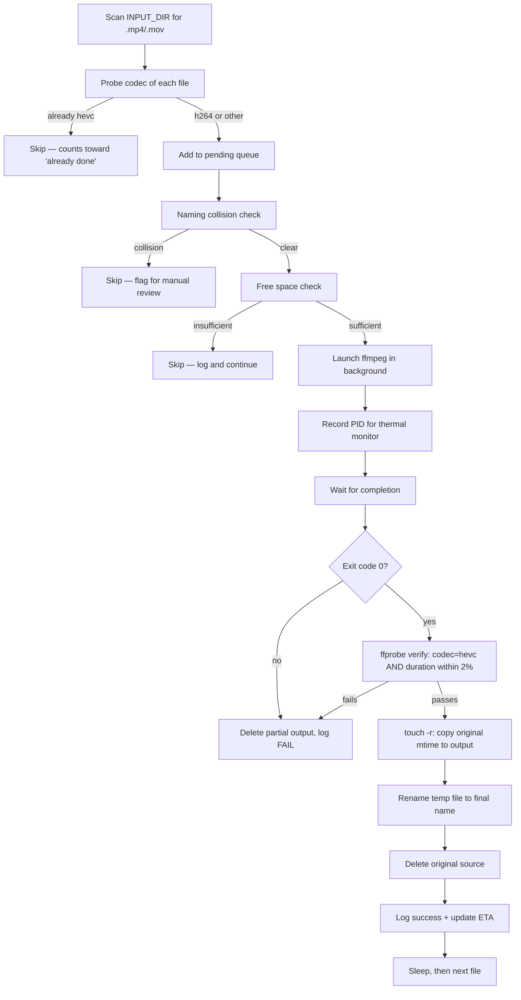

# h265-batch-reencoder

A safety-first Bash script that batch re-encodes H.264 footage to H.265/HEVC **in place**, on the **same disk** the source files live on — built specifically for the case where you don't have a second drive to stage the output on, and can't afford to lose data if something goes wrong mid-run.

Originally built for re-encoding Canon EOS 600D footage (40Mbps H.264 MOV) down to space-efficient HEVC, but the core logic is generic to any H.264 → H.265 batch workflow on a single volume.

> **TL;DR:** Point it at a folder. It finds every `.mp4`/`.mov`, re-encodes anything not already HEVC, verifies the output is actually intact before touching the original, preserves filenames/dates/metadata, and survives crashes, power loss, thermal throttling, and Ctrl+C without corrupting anything.

---

## Table of Contents

- [Why this exists](#why-this-exists)
- [Features](#features)
- [Requirements](#requirements)
- [Installation](#installation)
- [Quick Start](#quick-start)
- [Usage](#usage)
- [How It Works](#how-it-works)
  - [Per-file pipeline](#per-file-pipeline)
  - [Resumability model](#resumability-model)
  - [Thermal pause/resume](#thermal-pauseresume)
- [Configuration](#configuration)
- [Safety Mechanisms](#safety-mechanisms)
- [Pre-flight Drive Health Check (recommended)](#pre-flight-drive-health-check-recommended)
- [Testing Before a Full Run](#testing-before-a-full-run)
- [Logging](#logging)
- [Known Limitations](#known-limitations)
- [Troubleshooting](#troubleshooting)
- [License](#license)

---

## Why this exists

Re-encoding a large video library to save space sounds simple until you hit the real-world constraints:

- You only have **one disk**, so source and output have to coexist on it, at least temporarily — meaning a naive "encode everything, then delete originals" approach can fill the disk before it's done.
- The job takes **days**, not minutes, so it has to be interruptible and resumable without babysitting or re-encoding work that's already done.
- It's running on **aging hardware** in a hot climate, so silent overheating-induced drive failure is a real risk, not a hypothetical one.
- A corrupted output must **never** result in a deleted original — that's the one mistake that can't be undone.

This script is the result of designing around all four constraints simultaneously, rather than bolting on safety after the fact.

## Features

| Category | What it does |
|---|---|
| **Integrity** | Verifies every output with `ffprobe` (codec check + duration match within 2%) before deleting the source — not just trusting FFmpeg's exit code |
| **Resumability** | Detects already-converted files by probing actual codec (not filename), so interrupted runs, renamed files, or partially-converted libraries all resume correctly |
| **Crash recovery** | Sweeps and removes orphaned partial outputs left by hard crashes/power loss on every startup |
| **Thermal safety** | Pauses (SIGSTOP) the active encode when the drive gets too hot, resumes (SIGCONT) once it cools — no data loss, no manual restart |
| **Drive health** | Pre-flight SMART check (reallocated/pending/uncorrectable sector counts) aborts before touching a failing drive |
| **Space safety** | Confirms free space exceeds the next file's size before starting, since source and output share the same volume |
| **Metadata preservation** | Original filename, file modification time (`mtime`), and embedded container metadata (e.g. camera `creation_time`) all survive the conversion |
| **Crash-safe cleanup** | SIGINT/SIGTERM trap removes partial output files on Ctrl+C; never leaves a half-written file lying around |
| **Concurrency safety** | Lockfile prevents two instances from hammering the same folder simultaneously |
| **Low system impact** | `ionice -c3` (idle I/O class) + `nice -n19` (lowest CPU priority) keep the encode out of the way of normal system use |
| **Session control** | Optional time cap so you can run "two hours tonight" instead of multi-day unattended sessions on an old drive |
| **Visibility** | Live FFmpeg progress stats, plus a running ETA computed from actual measured throughput |
| **Logging** | Persistent, append-across-runs logfile with per-file size/ratio/timestamp records |

## Requirements

```
ffmpeg (with libx265)
ffprobe
smartmontools (smartctl)
util-linux (ionice, flock)
coreutils (nice, df, stat, sort)
gawk/awk
```

On Fedora/Nobara:

```bash
sudo dnf install ffmpeg smartmontools util-linux coreutils
```

On Debian/Ubuntu:

```bash
sudo apt install ffmpeg smartmontools util-linux coreutils
```

`smartctl` requires root. Set up passwordless sudo for it once — **this is important for long unattended runs**, since the background temperature monitor calls `smartctl` every 15 seconds, and an expired sudo timestamp partway through a multi-hour session will silently break temperature monitoring with no terminal to prompt on:

```bash
echo "$USER ALL=(ALL) NOPASSWD: /usr/sbin/smartctl" | sudo tee /etc/sudoers.d/smartctl-nopasswd
sudo chmod 440 /etc/sudoers.d/smartctl-nopasswd
```

## Installation

```bash
git clone https://github.com/<your-username>/h265-batch-reencoder.git
cd h265-batch-reencoder
chmod +x h265_batch.sh
```

## Quick Start

```bash
./h265_batch.sh /path/to/videos /dev/sdX
```

That's it for a one-off, unlimited-duration run. For an ongoing daily workflow with a time-boxed session:

```bash
./h265_batch.sh /path/to/videos /dev/sdX 180   # stop cleanly after 3 hours
```

## Usage

```
h265_batch.sh [INPUT_DIR] [SMART_DEVICE] [MAX_SESSION_MINUTES]
```

| Argument | Default | Description |
|---|---|---|
| `INPUT_DIR` | `.` | Directory to scan recursively for `.mp4`/`.MP4`/`.mov`/`.MOV` files |
| `SMART_DEVICE` | `/dev/sda` | Block device backing `INPUT_DIR` — used for SMART health/temperature checks. Find yours with `df -h /path/to/videos` or `lsblk` |
| `MAX_SESSION_MINUTES` | `0` (unlimited) | Stop cleanly between files once this many minutes have elapsed. Already-converted files are always detected and skipped, so resuming later picks up exactly where you left off |

**Examples:**

```bash
# Scan current directory, default device, run until done
./h265_batch.sh

# Real example: external HDD, capped 3-hour evening session
./h265_batch.sh "/run/media/user/MyDrive/Karaoke" /dev/sdc 180
```

## How It Works

### Per-file pipeline



### Resumability model

Most batch-encode scripts track progress by checking whether an output filename already exists. That breaks the moment you want the output to keep the **original filename** — there's no separate name left to check against.

Instead, this script probes the actual video codec of every candidate file with `ffprobe` before deciding what to do with it:

```bash
ffprobe -select_streams v:0 -show_entries stream=codec_name ...
```

Since your source camera only ever shoots H.264, **any file that already reports `hevc` must be one of this script's completed outputs** — regardless of what it's named, what folder it's in, or whether a previous run got interrupted partway through. This makes resumability completely independent of filenames, timestamps, or any state file that could itself get out of sync with reality.

### Thermal pause/resume

Rather than aborting the whole session when the drive gets hot, a background monitor polls SMART temperature attributes (194/190) every 15 seconds and directly signals the active FFmpeg process:

- **At `TEMP_HALT`°C** → sends `SIGSTOP` to the FFmpeg process. This fully suspends it — zero CPU usage, zero disk I/O — letting the drive cool passively with no risk of corrupting the in-progress encode.
- **At `TEMP_RESUME`°C** → sends `SIGCONT`, and FFmpeg picks up exactly where it was paused, mid-frame, with no rework.

The gap between halt and resume thresholds (hysteresis) exists so the script doesn't rapidly flap between pausing and resuming right at the boundary temperature — it commits to a real cool-down before resuming.

This means the script can run unattended through a hot afternoon, pause itself for however long it takes to cool down, and resume entirely on its own — no monitoring or manual restarts required.

## Configuration

All tunables live as variables near the top of the script:

| Variable | Default | Notes |
|---|---|---|
| `TEMP_HALT` | `50` (°C) | Pause encoding at/above this drive temperature |
| `TEMP_RESUME` | `45` (°C) | Resume once cooled to at/below this |
| `CRF` | `18` | Constant Rate Factor — lower = higher quality/larger file. 18 is visually transparent for most source material |
| `PRESET` | `medium` | x265 preset. `slow`/`slower` improve compression ~5-10% but cost 2-3x encode time — usually not worth it for large libraries |
| `AUDIO_BR` | `192k` | AAC audio bitrate |
| `SLEEP_BETWEEN` | `5` (seconds) | Pause between files, easing sustained I/O/thermal load |

## Safety Mechanisms

**SMART pre-flight (runs once at startup).** Aborts before touching the drive if any of these are non-zero:

| Attribute ID | Name | Meaning if non-zero |
|---|---|---|
| 5 | Reallocated_Sector_Ct | Sectors have already failed and been remapped |
| 197 | Current_Pending_Sector | Unstable sectors awaiting remap — early failure signal |
| 198 | Offline_Uncorrectable | Sectors that couldn't be corrected — active data risk |

**Output verification (runs after every encode, before deletion).** A zero exit code from FFmpeg is not sufficient proof of a good file — it can exit 0 on a file truncated by a disk-full condition mid-mux. The script independently confirms via `ffprobe`:
1. Output file exists and is non-empty
2. Video stream codec is genuinely `hevc`
3. Output duration is within 2% of the source duration

Only if all three pass does the original get deleted.

**Crash-safe temp files.** Outputs are written to a `*.h265part.mp4` working name during encoding, only renamed to the final name after verification passes. Combined with a startup sweep that removes any leftover `.h265part.mp4` files, a hard crash or power loss never leaves ambiguity about what's safe.

## Pre-flight Drive Health Check (recommended)

Before trusting any drive — especially an older one — with a multi-day write-heavy job, run a full SMART self-test once:

```bash
sudo smartctl -t long /dev/sdX      # takes 2-4 hours depending on drive size
# ... wait ...
sudo smartctl -a /dev/sdX           # check results
```

If reallocated/pending/uncorrectable counts come back non-zero, **back up that drive before running anything else** — the encode is not the priority at that point.

To watch temperature live in a second terminal during a run:

```bash
watch -n 15 "sudo smartctl -A /dev/sdX | awk '(\$1==190||\$1==194){printf \"ID%-3s %-30s %s°C\n\",\$1,\$2,\$10}'"
```

## Testing Before a Full Run

Don't point this at a large library untested. Run a single-file, 60-second test first:

```bash
ffmpeg -nostdin -hide_banner \
  -i "/path/to/sample.MOV" \
  -map 0:v:0 -map "0:a:0?" \
  -c:v libx265 -crf 18 -preset medium \
  -c:a aac -b:a 192k \
  -pix_fmt yuv420p -tag:v hvc1 \
  -movflags +faststart \
  -t 60 \
  /tmp/test_output.mp4 \
&& ffprobe -v error \
     -show_entries stream=codec_name,width,height,r_frame_rate \
     -show_entries format=duration,size \
     -of default \
     /tmp/test_output.mp4
```

Confirm `codec_name=hevc`, resolution/framerate match the source, and the file plays back cleanly before running the batch script on anything you can't afford to lose.

## Logging

A persistent logfile (`h265_encode.log`, next to the script) accumulates across every run, with a session header each time:

```
[2026-06-17 13:20:02] START [1/4]: MVI_0320.MOV
[2026-06-17 13:20:02]        Source: 4085 MB | Free: 785298 MB
[2026-06-17 13:24:51] OK:  MVI_0320.MOV → MVI_0320.mp4 | 4085 MB → 602 MB (14.7%)
[2026-06-17 13:24:51]        Progress: 1/4 this session | ETA remaining: 0h 14m at current rate
```

A separate row-formatted entry is also written per file for easy parsing:

```
[2026-06-17 13:24:51] MVI_0320.MOV    | ORIG:   4085 MB | COMP:    602 MB | RATIO: 14.7%  | SUCCESS
```

## Known Limitations

- **Naming collisions are skipped, not resolved automatically.** If `clip.MOV` and `clip.mp4` both exist as genuinely separate source files sharing a stem, the script refuses to guess which is which and logs it for manual review rather than risk overwriting unrelated footage.
- **The session time cap counts wall-clock time, including any thermal pause duration.** A "3 hour session" interrupted by an hour of heat-induced pausing only gets ~2 hours of actual encoding done. This is intentional — better to under-promise than to run unexpectedly long into hours you didn't intend.
- **Source and output share one disk by design**, which is the whole point of this script — but it also means a catastrophic drive failure mid-run still takes everything with it. SMART pre-flight checks reduce this risk; they don't eliminate it. If your data matters and you don't have a backup elsewhere, get one before running this at scale.
- **Compression ratio is highly content-dependent.** Static, low-motion footage (talking heads, karaoke, presentations) can see 80%+ size reduction at CRF 18. Footage with lots of motion or fine detail will see proportionally less.

## Troubleshooting

**`Trailing garbage at the end of a stream specifier: ?`** — this means a `?` optional-stream marker was used somewhere FFmpeg doesn't support it (e.g. on `-map_metadata` rather than `-map`). Not present in the current version of the script; if you've modified the FFmpeg invocation, check this first.

**SMART checks fail or device not found** — confirm you're pointing at the correct block device with `lsblk` or `df -h /path/to/videos`. The script needs the physical disk (`/dev/sdc`), not a partition or mount path.

**Temperature monitoring silently stops working mid-run** — almost always a sudo password prompt timing out in the background with no terminal attached. Set up the passwordless sudo rule for `smartctl` described in [Requirements](#requirements).

**Script can't find any candidate files** — check the extension case-sensitivity and that you're pointing at the right directory; the `find` pattern is case-insensitive for `.mp4`/`.mov` already, so this is usually a path issue.

## License

MIT — see [LICENSE](LICENSE).
